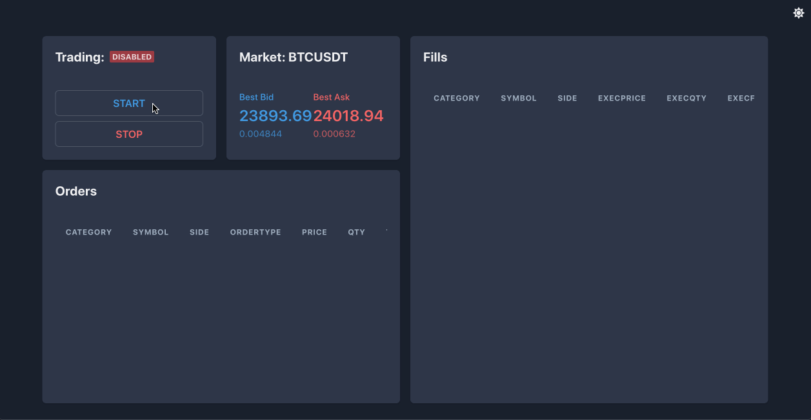

# bybit-market-maker
This is a basic proof of concept market making strategy showcasing usage of the bybit v5 api, a node.js websocket server, and a react front end for monitoring.



## Getting Started
There are 2 packages in this project:

- client
- server

The server app can be run remotely and without the client attached.  

### Install the dependencies:
Run the yarn install from the root of the project.  

```
$ yarn install
```

### Set up your environment variables:
Use `.env` as a template for creating `.env.local`:

```
$ cp packages/server/.env packages/server/.env.local
$ cp packages/client/.env packages/client/.env.local
```

Then, add your ByBit API key and secret to the .local version.  Do not check in your `.env.local` file into source control!!!

### Start up the back end (strategy-server.js):
This server app does a few things:
- Connects to ByBit's public and private websocket streams.
- Keeps track of the current market state.
- Broadcasts updates to the UI throttled at 100ms
- Listens for websocket connections from the UI, and any commands sent from it.

```
$ cd packages/server
$ npm run start
```
If you run into issues with your IP being blocked by ByBit, checkout the section on "Challenges".

### Start up the front end:
The front end is built with CRA and will open a browser tab when running in dev mode.  

```
$ cd packages/client
$ npm run start
```
The front end should open up after building and you should see the market data populating.  The back end will not start market making until the "Start" button is pressed on the UI.

## Challenges
IP blocking was the biggest challenge I ran into.  In order to get this working I had to use a web proxy for creating a testnet account.  I was not successful in getting the bybit-api to play nicely with any of the proxy agent injection packages out there.  Ultimately, in order to test my solution, I created a Google Cloud Run instance with a static outbound IP address in me-west1 region.  I ran the back end strategy server there, and then ran the client on my local machine.  This setup worked fairly well and caused no stability issues.  The extra infrastructure setup required is a bit of a grind, but you can learn more about setting up Google Cloud Run to work with a static outbound IP [here.](https://cloud.google.com/run/docs/configuring/static-outbound-ip)

## Suggested Enhancements
- Preload any existing open orders on startup.
- Preload any existing fills (for a given tail window) on startup.
- Move all hard coded config values into environment variables.
- Use promises in the strategy setup.
- Handle and test with other instrument categories (linear, option, etc).
- Improved cloud logging.